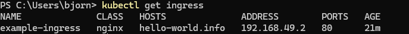

# minikube configuration

Note: the exact configuration will depend on your operating system
We follow this guide:
https://kubernetes.io/docs/tasks/access-application-cluster/ingress-minikube/
But there are deviations needed for windows
https://stackoverflow.com/questions/66275458/could-not-access-kubernetes-ingress-in-browser-on-windows-home-with-minikube

minikube addons enable ingress

There are two ways of configuring this
kubectl get ingress

C:\Windows\System32\drivers\etc\hosts
<Ingress Adress> <domain name>

Downside: The resolution will only work when execute request in the minikube ssh

There is another way also recommended when installing the addon
minikube tunnel
--> this will act as a bridge between 192.168.49.2 and 127.0.0.1
See image from minikube on enable of addons ingress

Note: Please be aware that there is another ingress running

For information about ingress:
https://kubernetes.io/docs/concepts/services-networking/ingress/
https://kubernetes.io/docs/reference/kubernetes-api/service-resources/ingress-v1/#IngressSpec

The docs explain IngressClasses to set up the multiple ingress controllers:
https://github.com/kubernetes/ingress-nginx/blob/main/docs/user-guide/multiple-ingress.md

"By default, deploying multiple Ingress controllers (e.g., ingress-nginx & gce) will result in all controllers simultaneously racing to update Ingress status fields in confusing ways."

## could not get the ingress-dns to work

- not working add on --> https://minikube.sigs.k8s.io/docs/handbook/addons/ingress-dns/
  note:
  unfortunately minikube addons enable ingress-dns was not working for me on windows, so:
  Multiple other users have experienced also expierenced this issue on Windows
