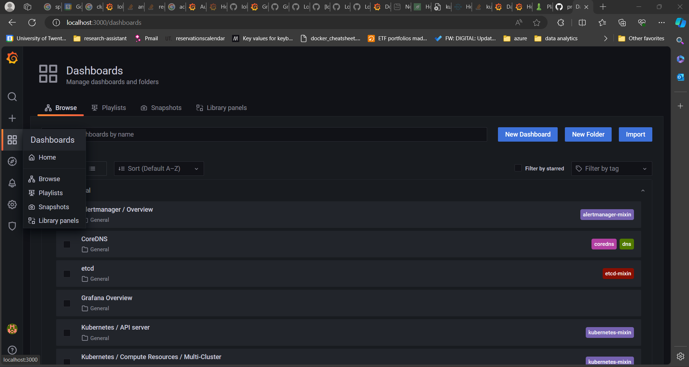
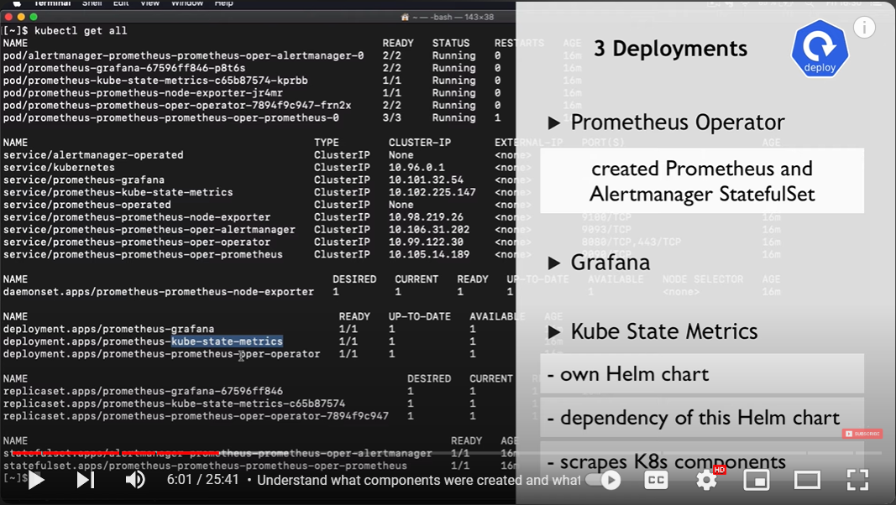
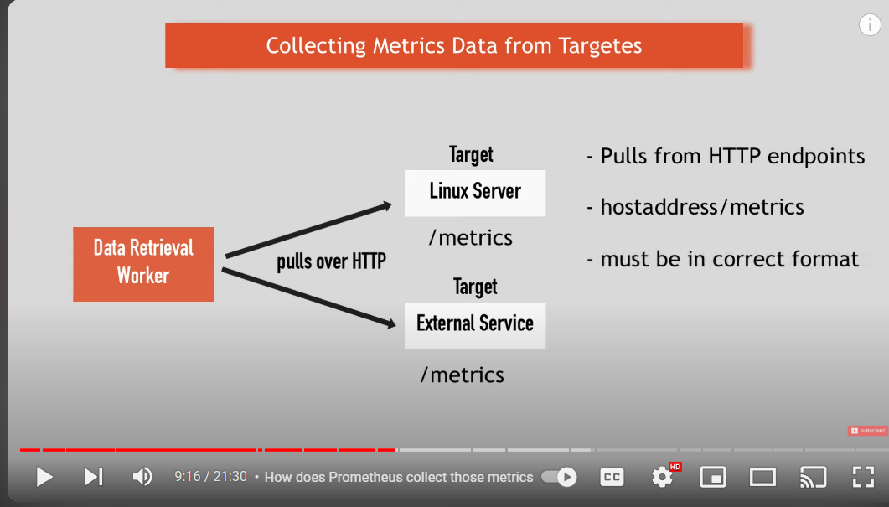

https://github.com/hashicorp/consul-k8s-prometheus-grafana-hashicups-demoapp/tree/master

tutorial: https://medium.com/@abdulfayis/using-prometheus-loki-and-grafana-to-monitor-in-kubernetes-904dc7ac9143

loki-grafana password:
admin
NyZ3KTFpvHIs6NWfDle63OwBE5S8Qq3kf3jsFQkJ

prometheus-stack-grafana
admin
prom-operator

# Set-up process

minikube start
kubectl create namespace monitoring

## Set-up process of grafana with

helm repo add prometheus-community https://prometheus-community.github.io/helm-charts
helm repo update prometheus-community
helm search repo prometheus-community

--> we are interested in the prometheus-community/kube-prometheus-stack
cd C:\Users\bjorn\Project-v2\soa\project\kubernetes-project-set-up (for me)
helm install prometheus-stack prometheus-community/kube-prometheus-stack --namespace monitoring --values ./prometheus/prometheus-values.yaml
--> the main thing changed in the prometheus-values.yaml is setting the grafana image to 8.5.3 which is necessary for the loki-stack as otherwise you will get version incompatibility

--> open a seperate window
kubectl port-forward service/prometheus-stack-grafana 3000:80 -n monitoring

log in to localhost:3000 with:
username: admin
password: prom-operator

Go to settings then datasources (The datasources should already be automatically preloaded)

helm repo add grafana https://grafana.github.io/helm-charts
helm repo update grafana
helm search repo grafana

--> only changed isDefault to false
--> we are interested grafana/loki-stack by default it has the grafana turned off which is good since we already installed it in the prometheus-stack
helm install loki-stack grafana/loki-stack -n monitoring --values ./loki/loki-values.yaml
--> the loki-values.yaml is just the default configuration of loki at the time of writing.

You can add the datasource under settings > data sources
There may be multiple ways to connect to loki. Multiple tutorials say http://loki:3100, but the one that has consistently worked for me is:
The url is: http://loki-stack.monitoring.svc.cluster.local:3100
OR http://loki-stack:3100
where loki-stack is the [NAME] in the helm install [NAME] [CHART] [flags] and monitoring is the namespace

currently the jaeger part infrastructure set up is till in draft, you can see it at ./DRAFT-JAEGER.md

For a simple explanation

https://www.youtube.com/watch?v=QoDqxm7ybLc

Prometheus PULLS by default from HTTP endpoints /metrics

For Jaeger see:
DRAFT-JAEGER.md

For installing the ingress controller see:
DRAFT-INGRESS-SETUP-WINDOWS.md

The ingress for monitor and services are stated /ingress

Installing the services:
helm install -n services microservices ./services/bettingAppChart

Notes:
General commands:
./gradlew.bat BootJar
docker build . -t bjornvanbraak/soa-project-group-20-{SERVICE_NAME}-service:alpha
docker push bjornvanbraak/soa-project-group-20-{SERVICE_NAME}-service:alpha

kubectl run -i --tty --image busybox:1.28 dns-test --restart=Never --rm

kubectl run alpine --image alpine --command -n services sleep -- 999d
kubectl exec -ti alpine -n services -- ash
